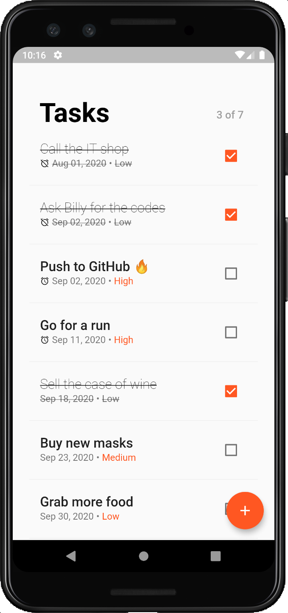
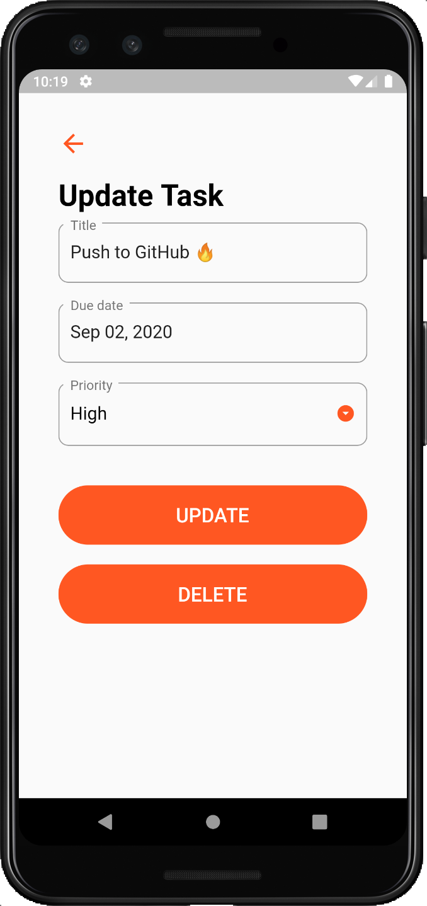

# tasker


Another Flutter "to-do list" App and it's one that uses [sqflite](https://pub.dev/packages/sqflite).




```bash
$ flutter pub run flutter_launcher_icons:main # generate the icons
$ flutter build apk --target-platform android-arm64 # build for Android
```

### TODO

- [x] Show an alarm icon for passed events
- [ ] Play with the intensity of the priority colour
- [x] Put Monday as the first day in the `showDatePicker`
- [ ] Create a SnackBar with an "Undo" action when delete
